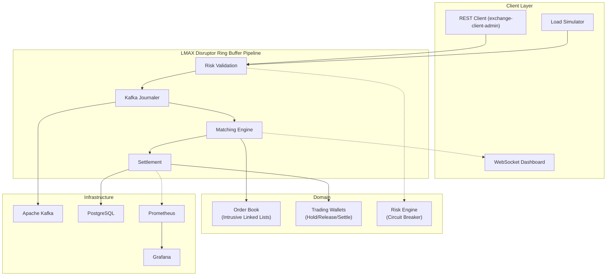

# LMAX Disruptor Cryptocurrency Order Matching Engine

A single-writer, allocation-lean cryptocurrency order matching engine built on the LMAX Disruptor mechanical sympathy pattern. A 3-minute Binance BTC/USDT + ETH/USDT replay averages **~687K events/sec** (667K post-warmup) through a 4-stage ring buffer pipeline (Risk Validation, Kafka Journaling, Price-Time Priority Matching, Settlement), while the isolated matching core sustains ~1 µs median (p50) latency on a 300K-deep order book. Benchmarks run with a `NoopJournaler` — enabling Kafka journaling instead bounds throughput by the synchronous `send().get()` round-trip (network + disk), a separate limit. The architecture minimizes hot-path allocation via Agrona primitive-keyed (boxing-free, on-heap) collections and intrusive linked-list price levels; the ~576 B/op that remains is short-lived and young-gen only, so no collection pauses were visible in the JMH latency distribution through p99.9 (~10 µs).

---

## System Architecture

The engine implements the single-writer principle through an LMAX Disruptor `RingBuffer<CommandBufferEvent>` coordinating four sequential `EventHandler` stages on a single thread. Inbound trading commands (PlaceOrder, CancelOrder) are dispatched into the ring buffer by gRPC stream observers and consumed in strict sequence:

```
Producer (gRPC) --> [RingBuffer] --> RiskValidation --> KafkaJournaler --> MatchingEngine --> Settlement
```

**Core design decisions:**

- **LMAX Disruptor ring buffer** eliminates inter-thread contention. All four pipeline stages execute on a single thread, removing the need for locks, CAS loops, or memory barriers between stages.
- **Agrona `Long2ObjectHashMap`** replaces `java.util.HashMap` for order ID lookups, avoiding boxing overhead and providing cache-friendly iteration with zero per-operation allocation.
- **Intrusive doubly-linked lists** at each price level (`PriceLevel.head/tail`) allow O(1) insertion and removal without allocating iterator or node wrapper objects.
- **`TreeMap<Long, PriceLevel>`** maintains price-time priority with O(log N) best-price access. Bids use `Collections.reverseOrder()` for highest-first traversal; asks use natural ordering.
- **HdrHistogram** (2 significant digits, 60s max trackable) records per-stage latency with sub-microsecond precision and negligible measurement overhead.

The system supports Leader/Follower/Learner cluster topologies via Kafka-based command log replication, with deterministic replay for state machine recovery.


```mermaid
graph TB
    subgraph "Client Layer"
        RC["REST Client (exchange-client-admin)"]
        WS["WebSocket Dashboard"]
        LS["Load Simulator"]
    end

    subgraph "LMAX Disruptor Ring Buffer Pipeline"
        RV["Risk Validation"]
        TJ["Kafka Journaler"]
        ME["Matching Engine"]
        SH["Settlement"]
    end

    subgraph "Domain"
        OB["Order Book\n(Intrusive Linked Lists)"]
        TW["Trading Wallets\n(Hold/Release/Settle)"]
        RE["Risk Engine\n(Circuit Breaker)"]
    end

    subgraph "Infrastructure"
        K["Apache Kafka"]
        M["PostgreSQL"]
        P["Prometheus"]
        G["Grafana"]
    end

    RC --> RV
    LS --> RV
    RV --> TJ --> ME --> SH
    RV -.-> RE
    ME --> OB
    SH --> TW
    ME -.-> WS
    TJ --> K
    SH --> M
    SH -.-> P --> G
```

---

## Benchmark Environment

| Property | Value |
|---|---|
| CPU | 12 logical cores |
| OS | Windows 11 |
| JDK | OpenJDK 21.0.10+8-LTS (HotSpot 64-Bit Server VM) |
| JMH micro-benchmark | JVM defaults — Java 21 **G1GC**, no heap/GC override |
| Binance replay | `-Xms4g -Xmx8g -XX:+UseZGC -XX:+AlwaysPreTouch` |

CPU model and total RAM were not captured in the run telemetry; the values above are those recorded in [`docs/benchmark/benchmark-results.json`](docs/benchmark/benchmark-results.json).

---

## Micro-Benchmark: Hot-Path Telemetry (JMH)

Isolated measurement of `OrderBookManager.processOrder()` -- no Disruptor, no Kafka, no gRPC, no risk validation, no settlement. Each operation is two `processOrder` calls: one aggressive (marketable) limit order that sweeps ~2–3 resting price levels, followed by one limit-order replenishment to maintain book depth. At 1.7M ops/sec that is ~3.4M `processOrder` calls/sec.

| Metric | Value |
|---|---|
| Throughput | 1,700,276 ± 112,884 ops/sec (single-threaded) |
| Order book depth | 3 symbols × (50K bids + 50K asks) = 300K resting orders |
| Cache topology | Fully fragmented (prices randomized across 10,000-deep spread) |
| Avg Latency (p50) | ~1 µs |
| Tail Latency (p99) | ~1 µs |
| Tail Latency (p99.9) | ~10 µs |
| Tail Latency (p99.99) | ~100 µs |
| Tail Latency (p99.999) | ~1 ms |
| Max observed (p100) | 27 ms |
| GC impact | No collection pauses visible through p99.9 (~10 µs); ~576 B/op (`-prof gc`), all young-gen |

```text
Benchmark                                                              Mode      Cnt        Score        Error  Units
MatchingEngineBenchmark.benchmarkMatching                             thrpt       20  1700276.309 ± 112883.806  ops/s
MatchingEngineBenchmark.benchmarkMatching                            sample  2468934       ≈ 10⁻⁶                s/op
MatchingEngineBenchmark.benchmarkMatching:benchmarkMatching·p0.00    sample                ≈ 10⁻⁷                s/op
MatchingEngineBenchmark.benchmarkMatching:benchmarkMatching·p0.50    sample                ≈ 10⁻⁶                s/op
MatchingEngineBenchmark.benchmarkMatching:benchmarkMatching·p0.90    sample                ≈ 10⁻⁶                s/op
MatchingEngineBenchmark.benchmarkMatching:benchmarkMatching·p0.95    sample                ≈ 10⁻⁶                s/op
MatchingEngineBenchmark.benchmarkMatching:benchmarkMatching·p0.99    sample                ≈ 10⁻⁶                s/op
MatchingEngineBenchmark.benchmarkMatching:benchmarkMatching·p0.999   sample                ≈ 10⁻⁵                s/op
MatchingEngineBenchmark.benchmarkMatching:benchmarkMatching·p0.9999  sample                ≈ 10⁻⁴                s/op
MatchingEngineBenchmark.benchmarkMatching:benchmarkMatching·p1.00    sample                 0.027                s/op
```

JMH configuration: `@Warmup(iterations = 5, time = 5)`, `@Measurement(iterations = 10, time = 5)`, `@Fork(2)`. Run with no CLI overrides — annotations drive the benchmark, so forks use JVM defaults (Java 21 → **G1GC**). Cnt=20 reflects 10 iterations × 2 forks. JMH `SampleTime` reports order-of-magnitude buckets, so p50–p99 are indistinguishable (~1 µs) at this resolution. The 27 ms p100 is a single outlier — a JIT/safepoint or G1 young-gen pause — while p99.999 stays ~1 ms.

---

## Macro-Benchmark: Binance Replay (3-Minute Run)

Full 4-stage LMAX Disruptor pipeline processing captured Binance BTC/USDT + ETH/USDT WebSocket depth data. The producer replays pre-recorded market events at maximum throughput into the ring buffer, exercising Risk Validation, Noop Journaling, Matching, and Settlement under continuous saturation. Kafka journaling is stubbed with a `NoopJournaler` (see Limitations).

| Metric | Value |
|---|---|
| Duration | 3 minutes (182.4s) |
| Total events processed | 125,322,426 |
| Average throughput | 687,210 ops/sec |
| Post-warmup throughput | 667,825 ops/sec |
| Total places / cancels | 93,636,633 / 31,685,793 |
| Total trades | 61,776 |
| Matching stage p50 | 19.8 ms |
| Matching stage p99 | 78.6 ms |
| Settlement stage p50 | 9.2 ms |
| Settlement stage p99 | 31.3 ms |
| Risk stage p50 | 27.1 ms |
| Risk stage p99 | 86.5 ms |
| Ring buffer residence (E2E) p50 | 65.0 ms |
| Ring buffer residence (E2E) p99 | 158.3 ms |
| Ring buffer residence (E2E) p99.9 | 1,166 ms |
| Dropped events | 0 |
| Parse errors | 0 |
| Order rejection rate | 67.31% (84.36M ÷ 125.32M total events) |
| Match rate | 0.07% (61,776 trades ÷ 93.64M placements) |

Note: 67.31% of all replayed events (84.36M ÷ 125.32M, places + cancels) are risk-rejected due to balance depletion under sustained stress load. The 687K ops/sec figure is **pipeline throughput** (risk + matching + settlement combined). Of events passing risk validation (~33%), most rest in the book without crossing the spread — the 0.07% match rate is trades ÷ placements (61,776 ÷ 93.64M), reflecting the synthetic price distribution of replayed depth deltas.

Ring buffer residence of 65–158 ms at p50/p99 is the time an event waits in the buffer under intentional saturation — the producer publishes faster than the pipeline drains, so events queue; the 1,166 ms p99.9 is the rare deep-queue tail when the buffer stays full. Per-handler latencies (Risk 87 ms p99, Match 79 ms p99, Settle 31 ms p99) are computational cost inclusive of inter-stage queueing delay. Percentiles are **not additive** — the p99 of end-to-end residence (158 ms) is not the sum of the per-stage p99s (196 ms). Post-warmup throughput (667,825) is *lower* than the overall average (687,210) because the first ~5 s ran against a still-shallow book with undepleted balances at ~1.37M ops/sec, lifting the average; the post-warmup figure is the representative steady-state rate. Under non-saturated operation, matching core latency is sub-microsecond (see JMH).

---

## Architectural Trade-offs and Limitations

**Ring buffer saturation and E2E latency.** The 158.3ms E2E p99 latency is a direct consequence of intentional ring buffer saturation. The replay benchmark feeds events via `ringBuffer.next()` (blocking), which causes the producer to stall when the buffer is full. The resulting queueing delay accumulates in the `RingBuffer` itself — not in the handlers. This is a deliberate design choice: the system queues rather than drops under extreme backpressure, ensuring zero data loss. Under non-saturated production load, the matching engine processes individual orders in sub-microsecond time (see JMH results).

**Single-writer bottleneck.** The single-writer principle guarantees cache-line isolation and eliminates false sharing, but pipeline throughput is bounded by the slowest handler stage — here the risk-validation logic, which runs under background balance replenishment every 10 seconds. The 3-minute replay averaged ~687K events/sec (667K post-warmup); higher aggregate throughput would come from horizontal scaling via partitioned order books on separate Disruptor instances.

**Kafka journaling overhead.** These benchmark results exclude Kafka — the engine runs with a NoopJournaler. If Kafka journaling is enabled (`CommandBufferJournalerImpl`), throughput degrades to the synchronous `producer.send().get()` round-trip, bounded by network I/O and disk flushing. A production Disruptor would use memory-mapped files (like the original LMAX) or asynchronous journaling, which is outside the scope of this project.

**Garbage collection telemetry.** While the intrusive linked lists eliminate *node allocations* during book traversal, the core is not zero-allocation. JMH profiling via `-prof gc` measures **~576 bytes per operation** — `Order` entities, Lombok builders, and `MatchingResult` records per match. At 1.7M ops/sec that is ~980 MB/sec, so young-gen collections *do* happen; they simply don't surface in the latency distribution through p99.9 (~10 µs). The isolated JMH core runs on Java 21's default **G1**; the Binance replay runs on **ZGC** (`-XX:+UseZGC`). Both keep these short-lived objects in young-gen. Achieving true zero-allocation would require comprehensive object pooling (e.g., using Disruptor pre-allocated event rings for all intermediate domain objects), which was deemed unnecessary given the architectural tradeoffs.

---

## Project Structure

```
shaky-towers/
  exchange-core/                # Core domain: OrderBook, Matching, Risk, Wallets, Disruptor handlers
  exchange-app/                 # Spring Boot: gRPC server, WebSocket, REST, Prometheus metrics
  exchange-client-core/         # Client-side Disruptor transport library
  exchange-client-admin/        # Admin REST API with gRPC trading client
  exchange-client-user/         # User-facing client application
  exchange-libs/
    common/                     # Shared exception hierarchy
    exchange-proto/             # Protobuf definitions (trading.proto, balance.proto)
  benchmark/
    benchmark-binance/          # Binance WebSocket capture + full pipeline replay
    benchmark-cluster/          # gRPC integration benchmark
    benchmark-cluster-jmh/      # JMH microbenchmark suite
  monitoring/                   # Prometheus scrape config, Grafana dashboard JSON
  docker-infra.yml              # Kafka, Zookeeper, PostgreSQL, Prometheus, Grafana
```

---

## Running the Exchange

### Prerequisites

- Java 21+
- Docker and Docker Compose (for Kafka, PostgreSQL, Prometheus, Grafana)

### Infrastructure

```bash
docker-compose -f docker-infra.yml up -d
```

### Build

```bash
./gradlew build -x test
```

### Start Leader Node

```bash
./gradlew :exchange-app:run-leader
```

Exposes gRPC on port 9500, HTTP on port 8800 (REST, WebSocket, dashboard).

### Start Admin Client

```bash
./gradlew :exchange-client-admin:run-admin
```

Exposes REST on port 8900.

---

## Reproducing Benchmarks

### JMH (Matching Core Isolated)

```bash
./gradlew :benchmark:benchmark-cluster-jmh:jmh
```

### Binance Replay (Full Pipeline)

```bash
# Step 1: Capture live Binance depth data
./gradlew :benchmark:benchmark-binance:run-capture

# Step 2: Replay at maximum throughput
./gradlew :benchmark:benchmark-binance:run-replay

# Step 3 (optional): Replay with Kafka journaling enabled
./gradlew :benchmark:benchmark-binance:run-replay-kafka
```

---

## API Surface

### gRPC (port 9500)

| Service | Method | Description |
|---|---|---|
| `TradingCommandService` | `sendCommand(stream)` | Bidirectional streaming: PlaceOrder, CancelOrder, CreateAccount, Deposit, Withdraw |
| `MarketDataService` | `subscribe(stream)` | Streaming order book snapshots |

### REST (port 8900)

| Method | Endpoint | Description |
|---|---|---|
| POST | `/api/v1/orders/place` | Place order (symbol, side, type, price, quantity) |
| POST | `/api/v1/orders/cancel` | Cancel order (orderId, symbol) |

### WebSocket (port 8800)

| Path | Description |
|---|---|
| `/ws/marketdata` | Level-2 order book snapshots |
| `/ws/latency` | P50/P95/P99 latency percentiles |

---

## Technology

| Component | Implementation |
|---|---|
| Ring buffer pipeline | LMAX Disruptor 4.x |
| Binary RPC | gRPC + Protobuf |
| Command journaling | Apache Kafka (`NoopJournaler` in benchmarks) |
| Application framework | Spring Boot 3 (virtual threads) |
| Primitive-key collections | Agrona `Long2ObjectHashMap` |
| Latency measurement | HdrHistogram |
| Metrics | Prometheus + Micrometer + Grafana |
| Persistence | PostgreSQL (snapshot recovery) |
| Microbenchmark | JMH (OpenJDK) |

---


## License

This project is licensed under the MIT License - see the [LICENSE](LICENSE) file for details.

